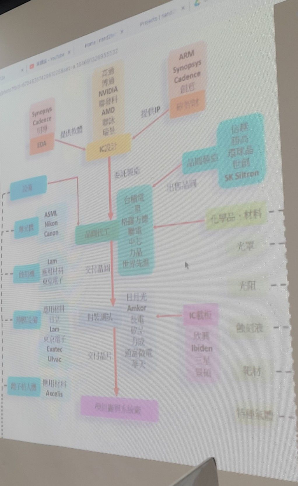

# Computer Structure

Week #2
Instal nand2tetris
Do Project 

Project 1: Boolean Logic
Project 2: Boolean Arithmetic
Project 3: Sequential Logic
Project 4: Machine Language
Project 5: Computer Architecture

Build the following logic gates on visual studio