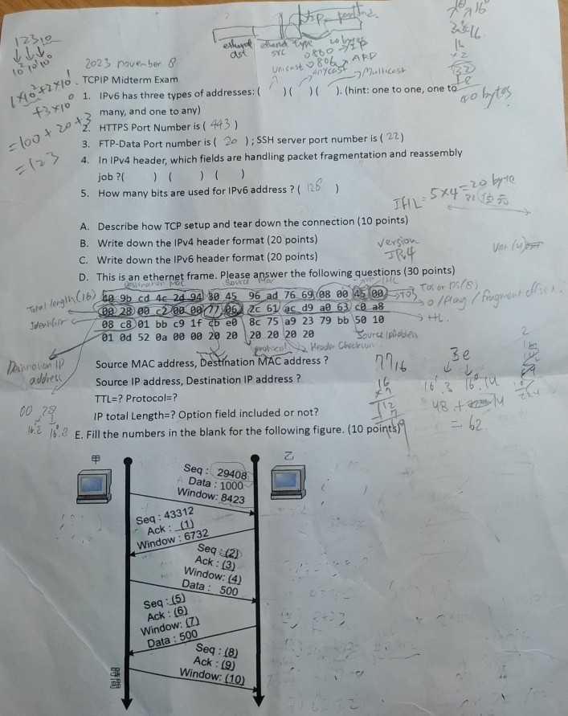
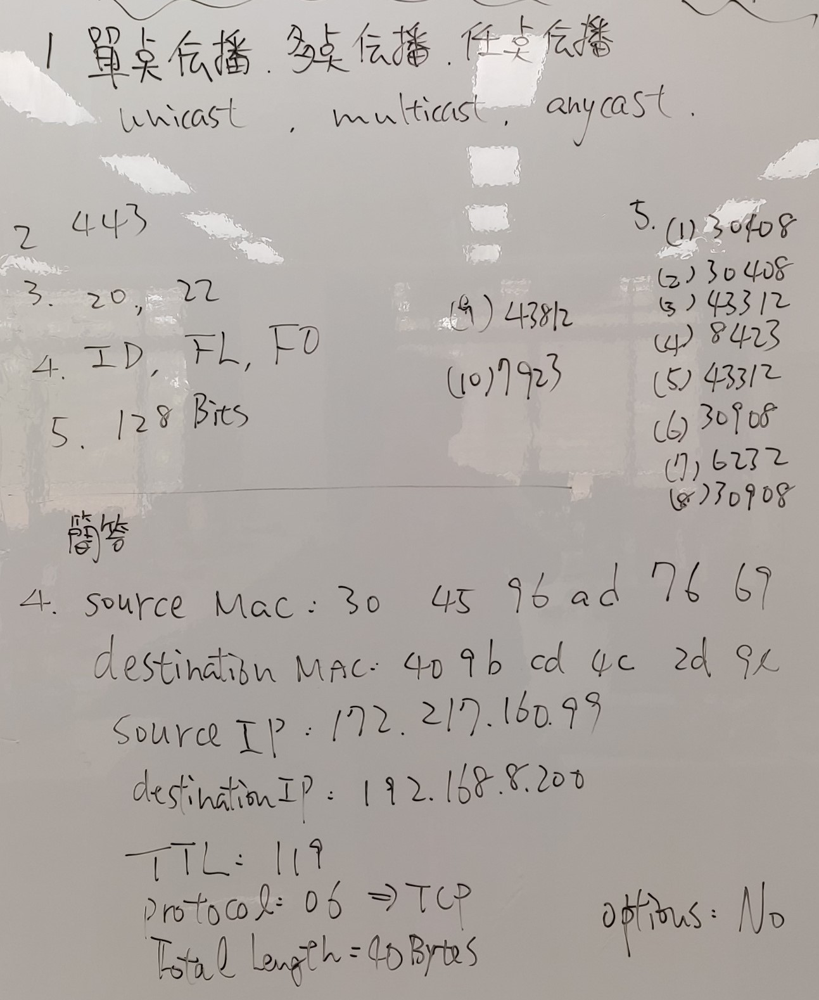

[https://www.canva.com/design/DAGijd4woMc/tZJrWIz5t-yn0aObv_NV0w/edit?utm_content=DAGijd4woMc&utm_campaign=designshare&utm_medium=link2&utm_source=sharebutton](https://www.canva.com/design/DAGn9mglJvk/0HwcXCWU7pxD21XMToiNhw/edit?utm_content=DAGn9mglJvk&utm_campaign=designshare&utm_medium=link2&utm_source=sharebutton)


https://www.canva.com/design/DAGpTpbdkWM/WDr2EetMU-G_HANlv6npiA/edit?utm_content=DAGpTpbdkWM&utm_campaign=designshare&utm_medium=link2&utm_source=sharebutton


# NQU Course Sharing
```
Course name: TCP/IP Protocol Suite 
Lecture: 柯志亨
Group: Elective Course (Three Credits)
Rating: 9/10 Points
Anynote: 
```


### 112Year, MidTerm Exam with answer
<div style="display:flex; flex-direction:row; justify-content: space-between; align-items: center;">
  
  
  
</div>

[https://www.canva.com/design/DAGSlRDKZ8U/1NUyByFUJRuSygZfiTpOkA/edit](https://www.canva.com/design/DAGSlRDKZ8U/1NUyByFUJRuSygZfiTpOkA/edit?utm_content=DAGSlRDKZ8U&utm_campaign=designshare&utm_medium=link2&utm_source=sharebutton)


