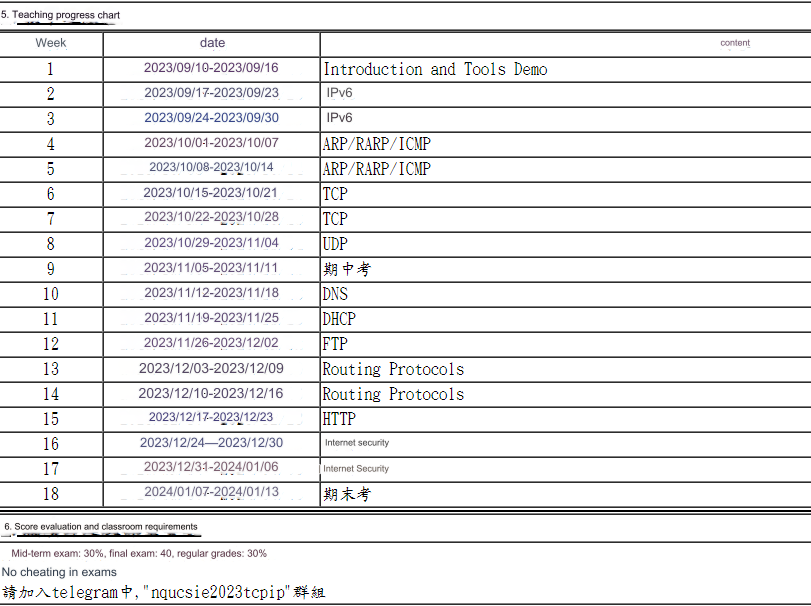

Subjek: Permohonan Peninjauan Ulang Akun – [Nomor WhatsApp Anda, misal: +62812XXXXXXX] – Taiwan Mobile Indonesia

Kepada Tim Dukungan WhatsApp,

Dengan hormat,

Kami menulis surat ini untuk mengajukan banding atas suspensi akun WhatsApp perusahaan kami dengan nomor [Masukkan Nomor WhatsApp Anda di sini, misal: +6281292736725]. Kami memahami akun ini terindikasi aktivitas "spam," namun kami meyakini ini adalah kesalahpahaman.

Saya Nicolas 鄭石光, Head of Talent Acquisition di Taiwan Mobile Indonesia. Akun WhatsApp ini adalah saluran komunikasi resmi yang kami gunakan secara eksklusif untuk proses rekrutmen. Komunikasi kami sepenuhnya berfokus pada upaya pencarian talenta dan undangan proses seleksi kepada kandidat yang relevan, yang kami peroleh dari platform profesional. Volume pesan yang terkirim merupakan bagian dari aktivitas rekrutmen proaktif kami, dan bukan spam atau promosi.

Kami menjamin bahwa semua komunikasi kami mematuhi pedoman penggunaan WhatsApp dan bersifat profesional. Kami siap menyediakan dokumentasi relevan yang membuktikan legitimasi penggunaan akun ini, jika diperlukan.

Pembekuan akun ini sangat mengganggu kelancaran proses rekrutmen kami. Oleh karena itu, kami memohon Tim Dukungan WhatsApp untuk melakukan peninjauan ulang secara manual dan mengaktifkan kembali akun kami.

Terima kasih atas waktu dan perhatian Anda.

Hormat saya,

Nicolas 鄭石光
Head of Talent Acquisition
Taiwan Mobile Indonesia
Email: NicolasZheng@taiwanmobile.com


[https://www.canva.com/design/DAGijd4woMc/tZJrWIz5t-yn0aObv_NV0w/edit?utm_content=DAGijd4woMc&utm_campaign=designshare&utm_medium=link2&utm_source=sharebutton](https://www.canva.com/design/DAGn9mglJvk/0HwcXCWU7pxD21XMToiNhw/edit?utm_content=DAGn9mglJvk&utm_campaign=designshare&utm_medium=link2&utm_source=sharebutton)


https://www.canva.com/design/DAGpTpbdkWM/WDr2EetMU-G_HANlv6npiA/edit?utm_content=DAGpTpbdkWM&utm_campaign=designshare&utm_medium=link2&utm_source=sharebutton

https://twmcloud-my.sharepoint.com/:f:/g/personal/kenthgdaniel_taiwanmobile_com/EpaVtyHtGsFJjnmo1lTqstwBmWGTx-Ibgj6JtWApXiM7zA?e=1hqP6L


# NQU Course Sharing
```
Course name: TCP/IP Protocol Suite 
Lecture: 柯志亨
Group: Elective Course (Three Credits)
Rating: 9/10 Points
Anynote: 
```



### 112Year, MidTerm Exam with answer
<div style="display:flex; flex-direction:row; justify-content: space-between; align-items: center;">
  
  
  
</div>

[https://www.canva.com/design/DAGSlRDKZ8U/1NUyByFUJRuSygZfiTpOkA/edit](https://www.canva.com/design/DAGSlRDKZ8U/1NUyByFUJRuSygZfiTpOkA/edit?utm_content=DAGSlRDKZ8U&utm_campaign=designshare&utm_medium=link2&utm_source=sharebutton)


