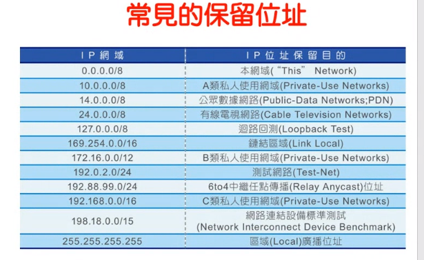

# TCP/IP 112
 The network card will not change

 here i just want to let y ou know when we say we send packace from a to b diretory,

 host a ip adres is 1.2
 host b ip adres is 1.3

source adress 1.2
target adres 1.3

host a, use mac a
host b, use mac b

host a use ARP, arp is thinks for broadcast all host in same address, if b recieve the boardcast, b will send a unicast to a to tell the adress

host c , ip adress 2.0 with network mask operation

they in

when a note recieve a packet it wills ent to uplayer 

when the packet arrive in mac layer 
if it broadcast it

