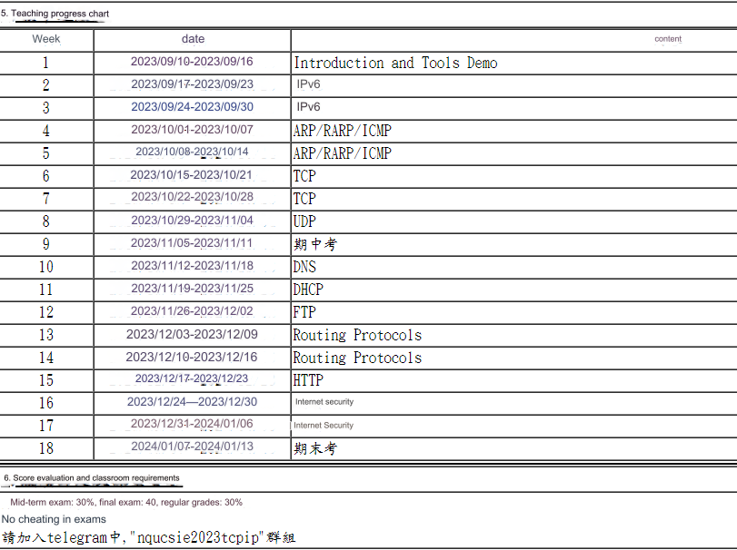
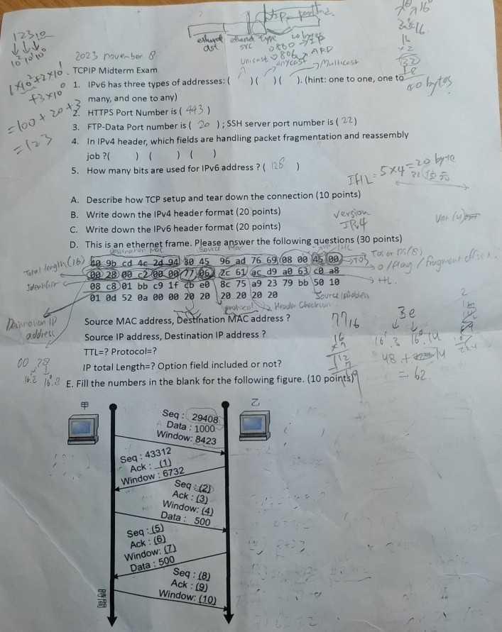
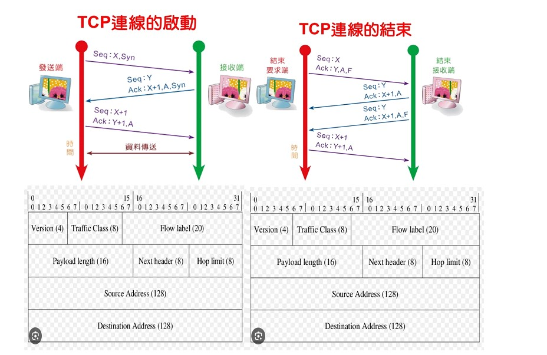

# NQU Course Sharing
```
Course name: TCP/IP Protocol Suite 
Lecture: 柯志亨
Group: Elective Course (Three Credits)
Rating: 9/10 Points
Anynote: 
```



### 112Year, MidTerm Exam with answer
<div style="display:flex; flex-direction:row; justify-content: space-between; align-items: center;">
  
  

</div>

